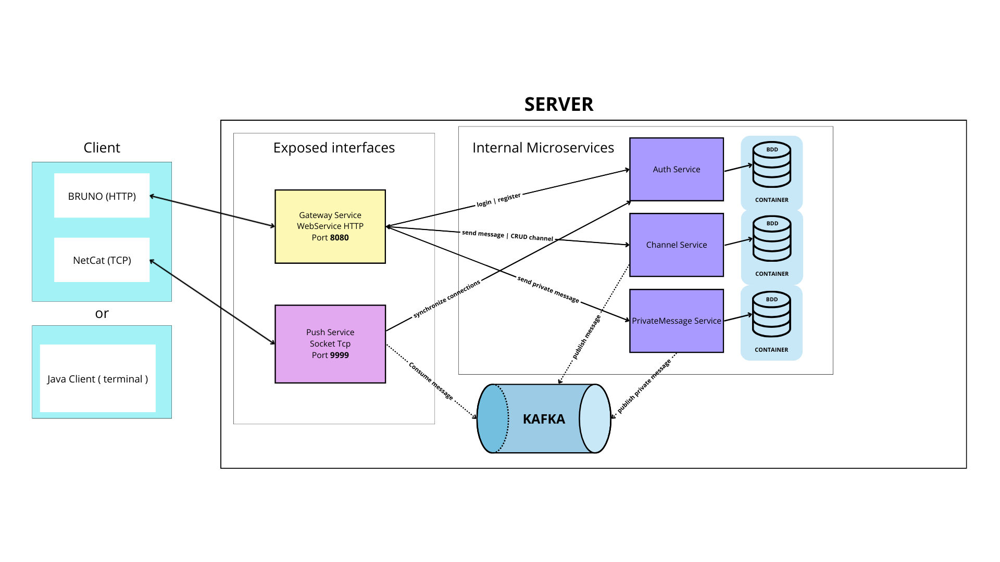

# 💬 TChat - Application de Messagerie en Temps Réel

<p align="center">
  
  
  
  
  
</p>

TChat est une application de messagerie en temps réel construite avec une architecture microservices moderne. Elle permet aux utilisateurs d'échanger des messages privés et de groupe de manière instantanée.

---

## 📋 Table des matières

- [🏗️ Architecture](#️-architecture)
- [🛠️ Prérequis](#️-prérequis)
- [🚀 Démarrage rapide](#-démarrage-rapide)
- [📦 Modules](#-modules)
- [🔌 API Endpoints](#-api-endpoints)
- [🐳 Docker](#-docker)
- [📝 Technologies](#-technologies)

---

## 🏗️ Architecture

TChat utilise une **architecture microservices** avec les composants suivants :



---

## 🛠️ Prérequis

Avant de commencer, assurez-vous d'avoir installé :

| Outil | Version | Lien |
|-------|---------|------|
| **Java JDK** | 21+ | [Download](https://adoptium.net/) |
| **Maven** | 3.9+ | [Download](https://maven.apache.org/download.cgi) |
| **Docker** | 24+ | [Download](https://www.docker.com/products/docker-desktop/) |
| **Docker Compose** | 2.0+ | Inclus avec Docker Desktop |

### Vérification des installations

```bash
# Vérifier Java
java -version

# Vérifier Maven
mvn -version

# Vérifier Docker
docker --version
docker-compose --version
```

---

## 🚀 Démarrage rapide

### Etape 1 : Lancement des instances BDD et Kafka avec Docker

```bash
# 1. Se positionner à la racine du projet
cd path/tchat

# 2. Démarrer les services d'infrastructure (MongoDB + Kafka)
docker-compose up -d

# 3. Vérifier que les services sont lancés
docker-compose ps
```

### Etape 2 : Lancement des microservices

#### Avec Maven Wrapper (Windows)

```powershell
# Depuis la racine du projet

# Compiler tous les modules
cd auth
.\mvnw.cmd clean install -DskipTests

# Lancer chaque service dans un terminal séparé

# Terminal 1 - Auth Service
cd auth
.\mvnw.cmd spring-boot:run

# Terminal 2 - Channel Service
cd channel
.\mvnw.cmd spring-boot:run

# Terminal 3 - Message Service
cd message
.\mvnw.cmd spring-boot:run

# Terminal 4 - Push Service
cd push
.\mvnw.cmd spring-boot:run

# Terminal 5 - Gateway (à lancer en dernier)
cd gateway
.\mvnw.cmd spring-boot:run
```

#### Avec Maven (Linux/Mac)

```bash
# Compiler tous les modules
./mvnw clean install -DskipTests

# Lancer chaque service
./mvnw spring-boot:run -pl auth
./mvnw spring-boot:run -pl channel
./mvnw spring-boot:run -pl message
./mvnw spring-boot:run -pl push
./mvnw spring-boot:run -pl gateway
```

## 📦 Modules

### 🌐 Gateway (Port 8080)
Point d'entrée unique de l'application. Gère le routage et la sécurité.

- **Routage** : Redirige les requêtes vers les microservices appropriés
- **Sécurité** : Vérifie les tokens via le service Auth
- **Headers** : Ajoute `X-User-Id` aux requêtes authentifiées

### 🔐 Auth (Port 8081)
Gestion de l'authentification et des utilisateurs.

| Endpoint | Méthode | Description | Auth |
|----------|---------|-------------|------|
| `/auth/register` | POST | Inscription d'un utilisateur | ❌ |
| `/auth/login` | POST | Connexion et obtention du token | ❌ |
| `/auth/token` | GET | Vérification du token | ✅ |

### 📨 Message (Port 8083)
Gestion des messages privés entre utilisateurs.

| Endpoint | Méthode | Description | Auth |
|----------|---------|-------------|------|
| `/messages` | POST | Envoyer un message privé | ✅ |
| `/messages/{nickname}` | GET | Récupérer les messages avec un utilisateur | ✅ |

### 📢 Channel (Port 8082)
Gestion des canaux de discussion de groupe.

| Endpoint | Méthode | Description | Auth |
|----------|---------|-------------|------|
| `/channels` | POST | Créer un channel | ✅ |
| `/channels` | GET | Lister les channels | ✅ |
| `/channels/{channelName}` | DELETE | Supprimer un channel | ✅ |
| `/channels/{channelName}/subscribe` | POST | Rejoindre un channel | ✅ |
| `/channels/{channelName}/unsubscribe` | POST | Quitter un channel | ✅ |
| `/channels/{channelName}/messages` | POST | Envoyer un message dans le channel | ✅ |
| `/channels/{channelName}/messages` | GET | Récupérer les messages du channel | ✅ |

### 📤 Push (Port 8084 + TCP 9999)
Service de notification en temps réel.

- **Kafka Consumer** : Écoute les messages des topics utilisateurs
- **TCP Server** : Maintient les connexions avec les clients connectés
- **Connexion** : Les clients se connectent via TCP avec leur token

---

## 🔌 API Endpoints

### Authentification

#### Inscription
```bash
curl -X POST http://localhost:8080/auth/register \
  -H "Content-Type: application/json" \
  -d '{
    "nickname": "alice",
    "password": "password"
  }'
```

#### Connexion
```bash
curl -X POST http://localhost:8080/auth/login \
  -H "Content-Type: application/json" \
  -d '{
    "nickname": "alice",
    "password": "password"
  }'
```

#### Validation token
```bash
curl -X POST http://localhost:8080/auth/token \
  -H "Authorization: <TOKEN>"
```

**Réponse connexion et validation token :**
```json
{
  "nickname": "alice",
  "token": "eyJhbGciOiJIUzI1NiIsInR5cCI6IkpXVCJ9..."
}
```

### Messages privés

#### Envoyer un message
```bash
curl -X POST http://localhost:8080/messages \
  -H "Content-Type: application/json" \
  -H "Authorization: <TOKEN>" \
  -d '{
    "receiverNickname": "alice",
    "content": "Salut ! Comment vas-tu ?"
  }'
```

#### Récupérer tous ses messages privés
```bash
curl -X GET http://localhost:8080/messages \
  -H "Authorization: <TOKEN>"
```

### Channels

#### Créer un channel
```bash
curl -X POST http://localhost:8080/channels \
  -H "Content-Type: application/json" \
  -H "Authorization: <TOKEN>" \
  -d '{
    "channelName": "general"
  }'
```

#### Supprimer un channel
```bash
curl -X DELETE http://localhost:8080/channels/{channelName} \
  -H "Authorization: <TOKEN>"
```

#### Rejoindre un channel
```bash
curl -X POST http://localhost:8080/channels/{channelName}/subscribe \
  -H "Authorization: <TOKEN>"
```

#### Quitter un channel
```bash
curl -X POST http://localhost:8080/channels/{channelName}/unsubscribe \
  -H "Authorization: <TOKEN>"
```

---

## 🐳 Docker

### Commandes Docker utiles

```bash
# Démarrer tous les services d'infrastructure
docker-compose up -d

# Voir les logs
docker-compose logs -f

# Voir les logs d'un service spécifique
docker-compose logs -f kafka

# Arrêter tous les services
docker-compose down

# Arrêter et supprimer les volumes (reset complet)
docker-compose down -v

# Reconstruire les images
docker-compose build --no-cache

# Redémarrer un service
docker-compose restart kafka
```

### État des conteneurs

```bash
# Voir l'état des conteneurs
docker-compose ps

# Voir l'utilisation des ressources
docker stats
```

---

## 📝 Technologies

### Backend
- **Spring Boot** - Framework Java
- **Spring Cloud Gateway** - API Gateway
- **Spring Data MongoDB** - Persistance des données
- **Spring Kafka** - Messaging asynchrone
- **MapStruct** - Mapping d'objets
- **Lombok** - Réduction du boilerplate

### Infrastructure
- **MongoDB 8.0** - Base de données NoSQL
- **Apache Kafka** - Message broker
- **Docker** - Conteneurisation

### Sécurité
- **Authorization** - Authentification par token
- **BCrypt** - Hashage des mots de passe

---

## 📁 Structure du projet

```
TChat/
├── 📁 auth/                    # Service d'authentification
│   ├── src/main/java/
│   │   └── com/tchat/auth/
│   │       ├── config/         # Configuration (Kafka)
│   │       ├── controller/     # REST Controllers
│   │       ├── dto/            # Data Transfer Objects
│   │       ├── entity/         # Entités MongoDB
│   │       ├── exception/      # Gestion des exceptions
│   │       ├── mapper/         # MapStruct mappers
│   │       ├── repository/     # Repositories MongoDB
│   │       └── service/        # Logique métier
│   └── src/main/resources/
│       └── application.yml
│
├── 📁 channel/                 # Service de channels
│   └── (même structure que auth)
│
├── 📁 message/                 # Service de messages
│   └── (même structure que auth)
│
├── 📁 gateway/                 # API Gateway
│   ├── src/main/java/
│   │   └── com/tchat/gateway/
│   │       ├── config/         # Configuration routes
│   │       ├── dto/            # DTOs
│   │       └── filter/         # Filtres de sécurité
│   └── src/main/resources/
│       └── application.yml
│
├── 📁 push/                    # Service de push
│   ├── src/main/java/
│   │   └── com/alom/push/
|   |       ├── client/         # Appel service Client
│   │       ├── config/         # Configuration Kafka
│   │       ├── dto/            # DTOs
│   │       ├── kafka/          # Consumers Kafka
│   │       ├── service/        # Services
│   │       └── tcp/            # Serveur TCP
│   └── src/main/resources/
│       └── application.yml
│
├── 📄 docker-compose.yml       # Configuration Docker
├── 📄 pom.xml                  # POM parent Maven
└── 📄 README.md                # Ce fichier
```

---

## 📄 Licence

Ce projet est sous licence MIT. Voir le fichier [LICENSE](LICENSE) pour plus de détails.
